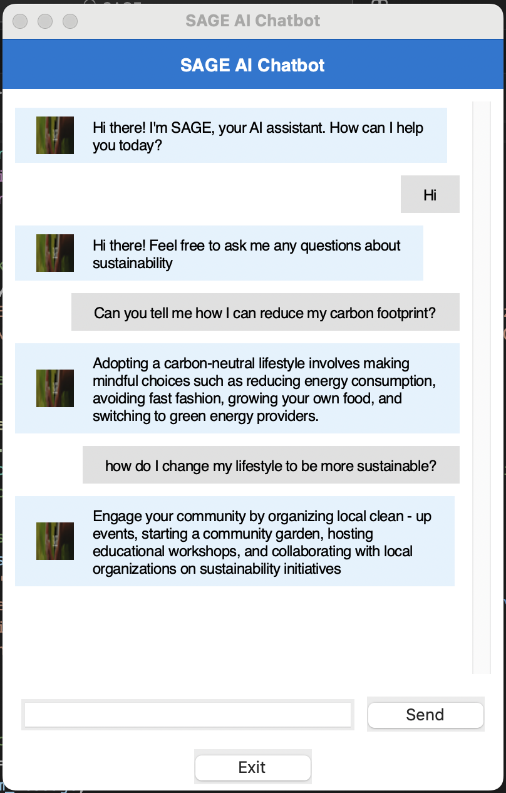
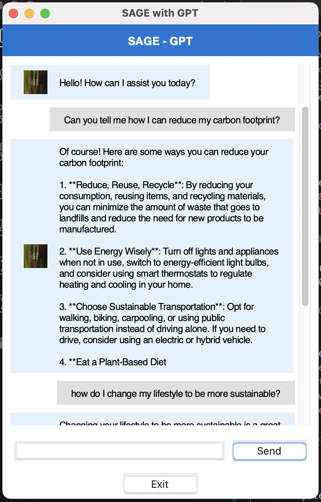
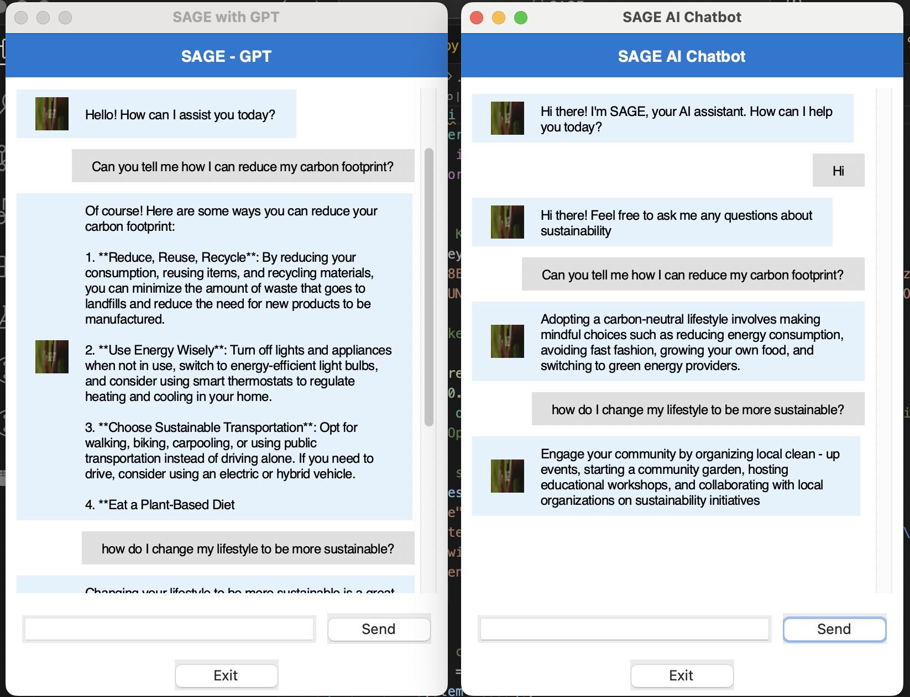
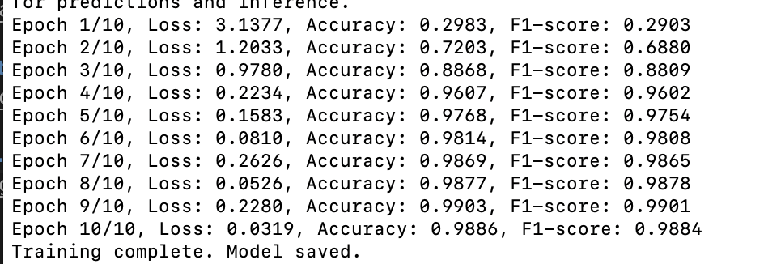

# **SAGE: AI-Powered Sustainability Chatbot**  

SAGE (**Sustainable Advisory & Guidance Expert**) is an **AI-powered chatbot** providing intelligent insights on sustainability. It offers **two chatbot versions**:  

- **DistilBERT-Based Chatbot:** Uses **intent recognition and NLP** for structured responses.  

- **GPT-Powered Chatbot:** Utilizes **OpenAI’s GPT-3.5 API** for dynamic, context-aware answers.  

This project compares **accuracy, response quality, and effectiveness** in aiding sustainability decision-making.  

🌍 Whether you're exploring **eco-friendly solutions**, **carbon footprints**, or **sustainable lifestyle choices**, **SAGE has you covered!**  


## **📸 Chatbot Interfaces**  

### **1️⃣ DistilBERT AI Chatbot (Intent-Based)**



### **2️⃣ GPT-Powered Chatbot (OpenAI API)**




### **3️⃣ Model Comparison: DistilBERT vs. GPT**




## **🚀 Setup & Installation**  

### **📌 Prerequisites**  

Ensure you have the necessary dependencies installed:  

If you're using **Conda**, create or update your environment:  

```bash
conda env create -f requirements.yml  # For a new environment  
conda env update --file requirements.yml --prune  # Update existing environment  
```

If using **pip**, install all dependencies:  
```bash
pip install -r requirements.txt
```


## **💡 Running SAGE**  

### **1️⃣ Setup OpenAI API Key (For GPT Version)**  
To use the GPT-powered chatbot, **get an OpenAI API key**:  
🔗 **Sign up at** [OpenAI API](https://platform.openai.com/signup)  
🛠 **Set your API key in the terminal:**  

```bash
export OPENAI_API_KEY="your-api-key-here"
```

---

### **2️⃣ Running SAGE Chatbots**  

#### **Option 1: Run Everything at Once**

```bash
make all
```

#### **Option 2: Run Step by Step**  

✅ **Train DistilBERT Chatbot (NLP Model)**  

```bash
make train
```

✅ **Run DistilBERT Chatbot (Intent-Based)**

```bash
make chat
```

✅ **Run GPT-Powered Chatbot**

```bash
make gptui
```

## **📈 Training Performance & Model Insights**  

I did 10 epochs, but you can try doing them from 5 to 7. to reduce time.

### **📊 Training Results (DistilBERT Model)**

| **Epoch** | **Loss** | **Accuracy** | **F1-score** |
|-----------|---------|-------------|--------------|
| **1/10**  | 3.1377  | 29.83%      | 29.03%       |
| **2/10**  | 1.2033  | 72.03%      | 68.80%       |
| **3/10**  | 0.9780  | 88.68%      | 88.09%       |
| **4/10**  | 0.2234  | 96.07%      | 96.02%       |
| **5/10**  | 0.1583  | 97.68%      | 97.54%       |
| **6/10**  | 0.0810  | 98.14%      | 98.08%       |
| **7/10**  | 0.2626  | 98.69%      | 98.65%       |
| **8/10**  | 0.0526  | 98.77%      | 98.78%       |
| **9/10**  | 0.2280  | 99.03%      | 99.01%       |
| **10/10** | 0.0319  | 98.86%      | 98.84%       |

🔹 **Training Screenshot:**  
  


## **🔬 Understanding the Results**  

📌 **Rapid learning:** Accuracy jumped from **29.8% to 88.6% in 3 epochs**  
📌 **Stabilized performance:** After **6 epochs, accuracy reached 98%+**  
📌 **Final accuracy: ~99%**, indicating **optimal chatbot readiness**  
📌 **Overfitting prevention:** No additional training required  


## **🤖 How SAGE Works**  

### **1️⃣ DistilBERT Chatbot (Intent-Based)**

🔹 Uses a **pre-trained NLP model**  
🔹 Matches **user input to predefined intents**  
🔹 Returns **structured, rule-based answers**  
🔹 Works **offline after training**  

### **2️⃣ GPT-Powered Chatbot (OpenAI API)**

🔹 Uses **OpenAI’s GPT model**  
🔹 Generates **real-time, contextual responses**  
🔹 Handles **open-ended, complex questions**  
🔹 Requires an **active internet connection & API key**  


## **🧠 Comparison: DistilBERT vs. GPT**  

| Feature                  | DistilBERT Chatbot | GPT-3.5 Chatbot |
|--------------------------|-------------------|-----------------|
| **Response Type**        | Rule-based        | Contextual & Dynamic |
| **Accuracy**             | High for structured queries | Adaptive & evolving |
| **Training Needed?**     | Yes (pre-trained NLP model) | No (API-based AI) |
| **Best Use Case**        | Quick predefined answers | Deep, AI-driven explanations |

By comparing the two models, SAGE explores the advantages of **rule-based AI** vs. **deep learning-based conversational AI** in addressing **sustainability queries**.  


## **User Experience & Expected Output**  

🖥️ **Graphical Interface:**  
- A **user-friendly** chatbot window  

💬 **Interacting with SAGE:**  
- **Type a question & hit enter** → Your query disappears, and SAGE provides an AI-generated response.  
- **Click "Exit"** → The chatbot closes gracefully.  

**🤖 GPT Mode Features:**  
- Handles **complex and open-ended queries** better than the DistilBERT model.  
- Generates **long-form, contextual answers** based on AI training data.  
- Uses **real-time GPT interaction** instead of predefined responses.  


## **Why SAGE Matters**  
- 🌍 **Sustainability-Focused:** AI-powered insights on eco-friendly solutions.  
- 🤖 **Machine Learning at Work:** Combines **intent recognition, NLP, and GPT AI** for better understanding.  
- 🎯 **User-Centric Design:** A clean, intuitive chatbot experience with **two AI models for comparison**.  

SAGE is more than just a chatbot—it’s a demonstration of **AI’s evolving role in sustainability education and decision-making**. 🌱💡  


🔹 **Ready to explore AI-driven sustainability? Run SAGE today!** 🚀  


---
#### **Authors:** Meghana Chillara, Zach Nichols, Tina Puzzo  

